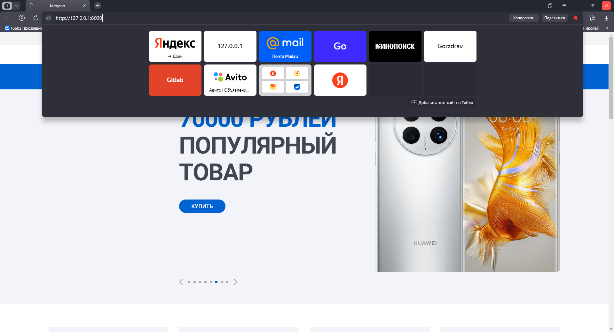
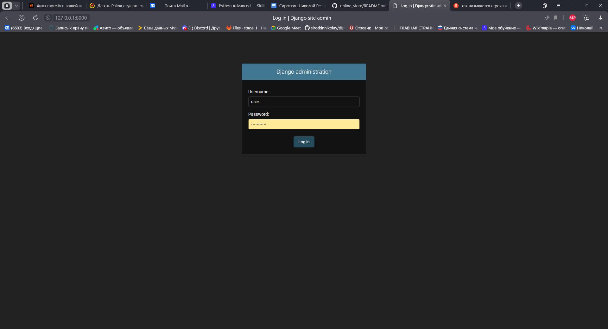

# online_store app
##online магазин по продаже электроники\
``выполните клонирование репозитория``\
git clone https://github.com/sirotkinnikolay/online_store.git

``установите необходивые библиотеки из файла requirements.txt``\
pip install -r requirements.txt

``примените миграции``\
python manage.py makemigrations\
python manage.py migrate

``зугрузите фикстуру для тестового запуска``\
python manage.py loaddata fixtures/online.json

``создайте суперпользователя,  введите логин и пароль для администратора ``\
python manage.py createsuperuser

``для входа на локальном сервере введите в адресную строку http://127.0.0.1:8000/ ``

``для входа в панель администратора введите в адресную строку http://127.0.0.1:8000/admin и введите
логин и пароль созданный при создании суперпользователя ``

- ###Шапка сайта 
состоит из ссылок на соцсети, ссылок на регистрацию и
авторизацию, логотипа — названия сайта, меню авторизованного пользователя,
включая иконку перехода на страницы сравнения и корзины, а также меню
для навигации по сайту, меню категорий товаров и строку для поиска.
Если пользователь авторизован, то ссылки на авторизацию и регистрацию
заменяются на ссылку на личный кабинет.
Меню содержит навигационное меню, состоящее из ссылок на различные
страницы сайта.
####
- ###Меню категорий
содержит категории товаров для удобной навигации по сайту.
В это меню попадают все активные категории товаров на сайте. Для каждой категории
в меню отображается текст и иконка, если она указана у этой категории.
Футер сайта состоит из названия сайта, навигационного меню по статичным
страницам и другой статичной информации.
####
- ###На главной странице выводятся следующие элементы:
три избранные категории товаров, каталог топ-товаров и слайдер
с ограниченным тиражом .
####
- На сайте отображается каталог товаров с возможностью фильтрации,
сортировки и постраничной навигации. 
####
- ###У каждого товара отображаются:
1. Название.
2. Изображение товара.
3. Краткое описание.
4. Цена товара.
5. Количество отзывов.
6. Кнопка «Купить».
####
- ###При нажатии на кнопку «Купить»
- происходит добавление товара в корзину.
Выводится всплывающее сообщение с подсказкой о том, что товар успешно добавлен
в корзину.
####
- ###Над каталогом
выводится блок с переключателями направления сортировки
со следующими возможностями: по популярности (количеству покупок товара),
по цене, по отзывам (их количеству), по новизне. Каждый переключатель можно
установить в направлении по возрастанию или убыванию, одновременно можно
применить только один вид сортировки.
####
- ###Рядом с каталогом товаров
выводится фильтр, с помощью которого можно
установить фильтрацию для вывода товаров в каталоге по названию, цене, наличию и 
с бесплатной доставкой.
####
- ###Детальная страница товара.
Отображается подробная информация о выбранном товаре, последние отзывы
с возможностью подгрузить ещё и добавить новый отзыв, а также цена на этот товар.
При нажатии на кнопку «Купить» происходит добавление товара в корзину.
Покупатель, если он авторизован, может добавить свой отзыв на товар.
В блоке «Цена» отображается цена на товар и кнопка «Купить», при нажатии
на которую происходит добавление товара в корзину.
####
- ###Оформление заказа
Раздел оформления заказа представляет собой последовательность шагов
по оформлению заказа, корзину и само оформление заказа.
####
- ###Корзина
На этой странице отображается корзина пользователя, все товары, которые
пользователь добавил в корзину. Для каждого товара
отображаются: название, изображение, краткое описание, цена, элементы управления
количеством и кнопка «Удалить».
Под корзиной выводится сводная информация, общая стоимость и кнопка
«Оформить», при нажатии на которую происходит переход на форму оформления заказа.
- ###Оформление заказа
На странице происходит последовательное пошаговое оформление заказа:
1. Указываются параметры пользователя.
2. Выбирается способ доставки.
3. Выбирается способ оплаты.
4. Отображается блок подтверждения заказа.

- ###Страница оплаты
Страница фиктивной оплаты.
Если пользователь выбрал способ оплаты «Онлайн картой», то нужно
отобразить поле «Номер карты», в которое можно ввести только число не длиннее
восьми цифр.
Если пользователь выбрал способ оплаты «Онлайн со случайного чужого
счёта», то рядом с полем для ввода номера счёта должна отображаться кнопка
«Сгенерировать случайный счёт», нажатие на которую подставляет случайное
восьмизначное число в поле.
Под полем ввода выводится кнопка «Оплатить».

После нажатия на кнопку «Оплатить» происходит валидация

1. если введённый номер чётный и не заканчивается на ноль, то оплата
подтверждается;
2. если введённый номер нечётный или заканчивается на ноль, то сервис
генерирует случайную ошибку оплаты.

На странице заказа в личном кабинете должен отображаться статус оплаты и
текст ошибки, если он есть.

- ###Личный кабинет
В этот раздел имеет доступ только покупатель на сайте (авторизованный
пользователь).
Личный кабинет
На сводной странице личного кабинета отображаются два блока:
● аватарка, Ф. И. О. и ссылка на редактирование профиля;
● последний заказ покупателя со ссылкой на него и на историю заказов
покупателя.
- ###Профиль
На этой странице пользователь может изменить Ф. И. О., телефон, email,
пароль и аватарку.
Поле email и Ф. И. О. обязательны для заполнения. В качестве аватарки можно
использовать только изображения размера не более 2 Мб. Телефон и email должны
быть уникальными на сайте.
- ###История заказов
Для каждого заказа выводится: общая стоимость, способы оплаты
и доставки, статус оплаты. Также можно перейти
на страницу этого заказа. На этой странице отображаются все поля заказа,
без возможности изменения, а также подробно отображается состав заказа. Кроме
того, если заказ не был оплачен , то на этой странице появляется кнопка,
чтобы произвести оплату снова — с возможностью выбрать другой способ оплаты и
изменить номер карты или счёта.